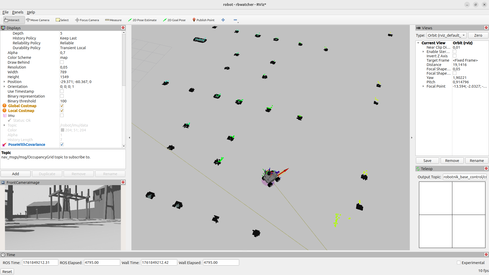
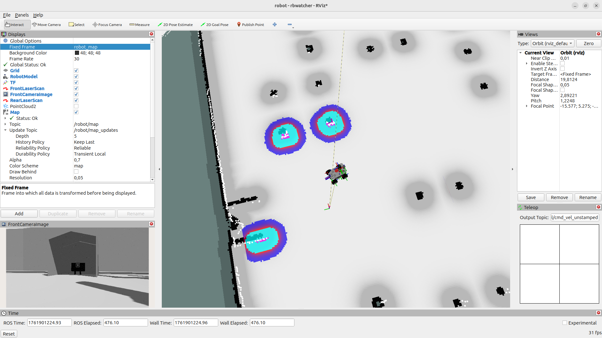
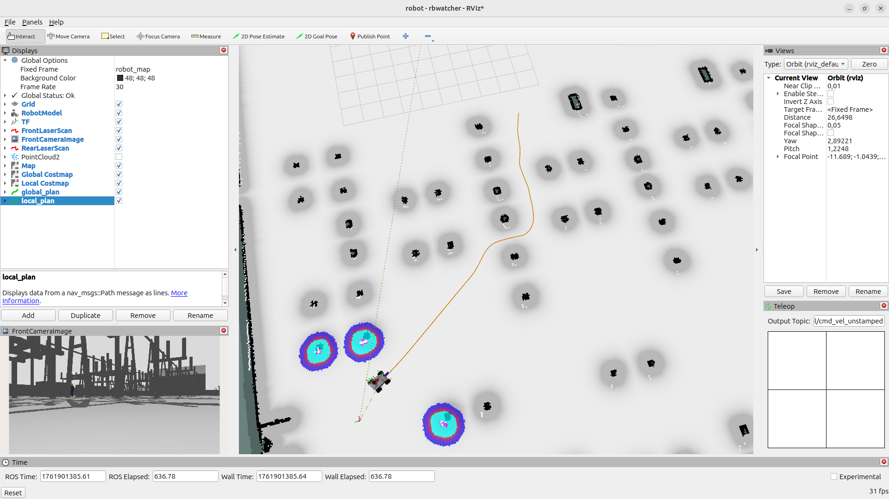
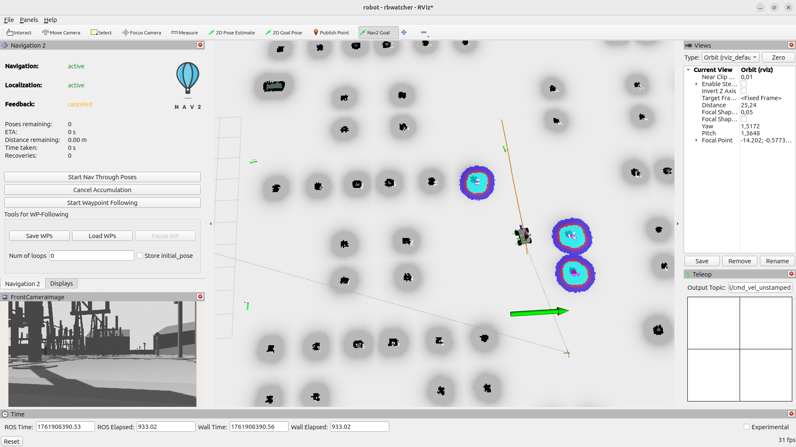
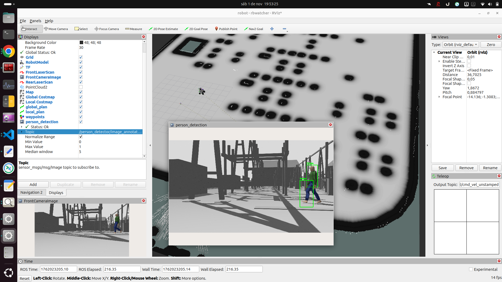
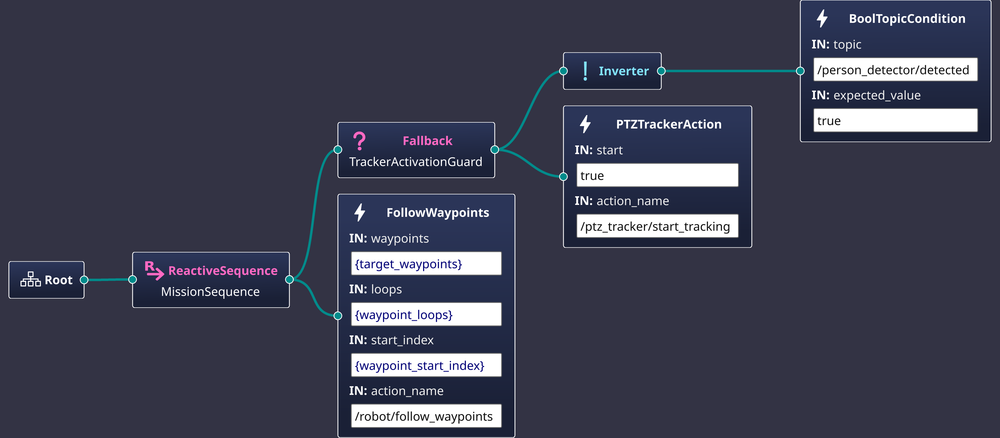
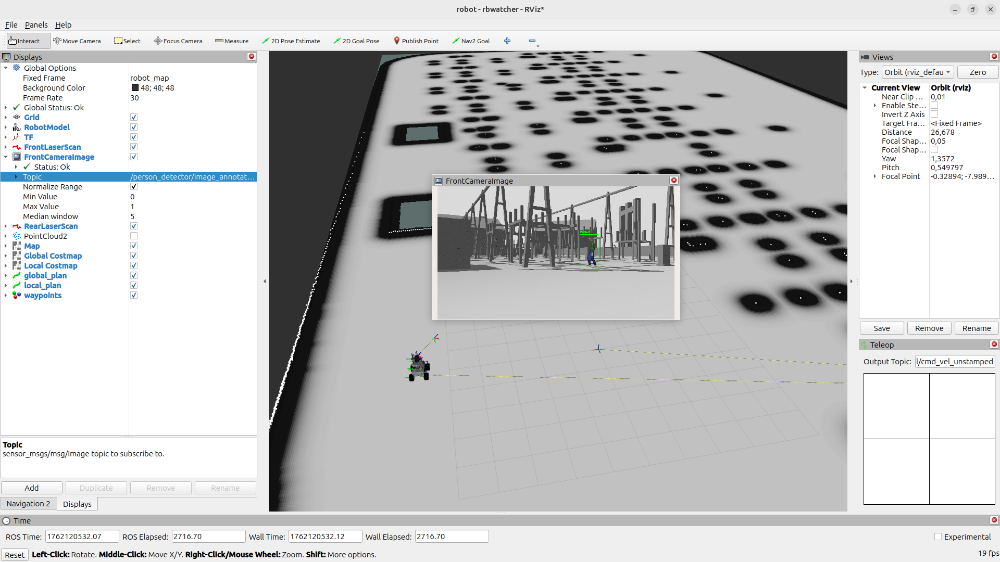

# roscon2025_rbwatcher_workshop

RB-Watcher ROS 2 digital twin for autonomous inspection at an electrical substation. The project combines Gazebo Harmonic simulation, the Nav2 navigation stack, and BehaviorTree.CPP to demonstrate guided patrol and reactive PTZ tracking workflows.


---

## Table of Contents

1. [Overview](#overview)
2. [Requirements](#requirements)
3. [Workspace Setup](#workspace-setup)
4. [Build Instructions](#build-instructions)
5. [Behavior Tree Tooling](#behavior-tree-tooling)
6. [Workshop Tasks](#workshop-tasks)
   - [Task 1 – Launch the Simulation](#task-1--launch-the-simulation)
   - [Task 2 – Controllers and Sensors](#task-2--controllers-and-sensors)
   - [Task 3 – Basic Control](#task-3--basic-control)
   - [Task 4 – Mapping](#task-4--mapping)
   - [Task 5 – Localization & Navigation](#task-5--localization--navigation)
   - [Task 6 – Perception](#task-6--perception)
   - [Task 7 – PTZ Person Tracking](#task-7--ptz-person-tracking)
   - [Task 8 – Autonomous Inspection with Behavior Trees](#task-8--autonomous-inspection-with-behavior-trees)
7. [Bringup Shortcuts](#bringup-shortcuts)

---

## Overview

The RB-Watcher is a mobile platform designed for persistent inspection and surveillance missions. This workshop package provides:

- A Gazebo Harmonic simulation of the RB-Watcher operating in an electrical substation.
- Launch and configuration assets to exercise Nav2, perception, and PTZ tracking components.
- A BehaviorTree.CPP action server (`rbwatcher_behaviors`) showcasing patrol-and-track missions using custom tree nodes.

---

## Requirements

- Ubuntu 24.04 with ROS 2 Jazzy and Gazebo Harmonic pre-installed.
- Desktop-class GPU recommended for running the Gazebo world and RViz simultaneously.
- Basic familiarity with ROS 2 CLI tools and the `colcon` build system.

---

## Workspace Setup

```bash
mkdir -p ~/workspaces/roscon_ws/src
cd ~/workspaces/roscon_ws/src
git clone --recurse-submodules -b jazzy-devel https://github.com/RobotnikAutomation/robot_packages.git
```

Install system dependencies and resolve ROS package requirements:

```bash
cd ~/workspaces/roscon_ws
sudo apt-get update
rosdep update
rosdep install --from-paths src --ignore-src -r -y
sudo apt install -y $(find -name '*ros-jazzy-robotnik*.deb')
```

---

## Build Instructions

```bash
cd ~/workspaces/roscon_ws
colcon build --symlink-install
source install/setup.bash
```

Re-source `install/setup.bash` in new terminals or add it to your shell profile.

---

## Behavior Tree Tooling

Visualize and edit trees with [Groot2](https://www.behaviortree.dev/groot/):

```bash
cd ~/Downloads
wget <Groot2 AppImage URL>
chmod +x Groot2-*.AppImage
./Groot2-*.AppImage
```


---

## Workshop Tasks

### Task 1 – Launch the Simulation

Launch the electrical substation world:

```bash
ros2 launch robotnik_gazebo_ignition spawn_world.launch.py \
  world_path:=$(ros2 pkg prefix electrical_substation_world)/share/electrical_substation_world/worlds/electrical_substation.world \
  gui:=true
```

Tips:

- Set `gui:=false` for a headless Gazebo session.
- Override `world_path` to experiment with alternative scenes.
- Reduce graphics load on low-powered machines:

```bash
export LOW_PERFORMANCE_SIMULATION=true
```

Spawn the RB-Watcher robot:

```bash
ros2 launch robotnik_gazebo_ignition spawn_robot.launch.py \
  robot:=rbwatcher x:=-19 y:=6 run_rviz:=true
```


Additional tweaks:

- Toggle RViz autostart via `run_rviz:=false`.
- Adjust initial pose with `x`/`y` parameters.
- Spawn extra robots by providing a unique `robot_id` so that namespaces stay isolated.

```bash
ros2 launch robotnik_gazebo_ignition spawn_robot.launch.py \
  robot:=rbwatcher x:=-19 y:=4 robot_id:=robot_2 run_rviz:=false
```

---

### Task 2 – Controllers and Sensors

Inspect command topics and sensor streams:

- Base odometry:

  ```bash
  ros2 topic echo /robot/robotnik_base_control/odom
  ```

- PTZ RGB-D camera (joint trajectory controlled):

  ```bash
  ros2 run rqt_image_view rqt_image_view /robot/top_ptz_rgbd_camera/color/image_raw
  ```

- Front RGB camera:

  ```bash
  ros2 run rqt_image_view rqt_image_view /robot/front_rgbd_camera/color/image_raw
  ```

- 3D LIDAR point cloud (visualize in RViz):

  

- IMU stream:

  ```bash
  ros2 topic echo /robot/imu/data
  ```

---

### Task 3 – Basic Control

- Teleoperate the base using keyboard commands:

  ```bash
  ros2 run teleop_twist_keyboard teleop_twist_keyboard \
    --ros-args -r cmd_vel:=/robot/robotnik_base_control/cmd_vel -p stamped:=true
  ```

- Alternatively, drive from RViz using the teleop panel:

  

- Command the PTZ camera with the joint trajectory controller plugin:

  ```bash
  ros2 run rqt_joint_trajectory_controller rqt_joint_trajectory_controller --ros-args --remap __ns:=/robot
  ```

  

---

### Task 4 – Mapping

1. Project the 3D LIDAR into a planar scan:

   ```bash
   ros2 launch robotnik_simulation_bringup laser_filters.launch.py
   ```

   

2. Run `slam_toolbox` and drive the robot to build a 2D map:

   ```bash
   ros2 launch robotnik_simulation_localization mapping_2d.launch.py
   ```

   

3. Save the resulting occupancy grid:

   ```bash
   ros2 run nav2_map_server map_saver_cli -f ~/map
   ```

   

---

### Task 5 – Localization & Navigation

**Localization**

```bash
ros2 launch robotnik_simulation_localization localization.launch.py
```



Set the initial pose in RViz (2D Pose Estimate) and validate pose tracking while teleoperating the robot.

**Navigation**

Launch Nav2:

```bash
ros2 launch robotnik_simulation_navigation navigation.launch.py
```



Send goals via RViz or CLI:

```bash
ros2 action send_goal /robot/navigate_to_pose nav2_msgs/action/NavigateToPose '{
  "pose": {
    "header": {"frame_id": "robot_map"},
    "pose": {
      "position": {"x": 1.5, "y": 0.5, "z": 0.0},
      "orientation": {"x": 0.0, "y": 0.0, "z": 0.0, "w": 1.0}
    }
  }
}'
```



Waypoint following examples:

Navigate Through Poses

```bash
ros2 action send_goal /robot/navigate_through_poses nav2_msgs/action/NavigateThroughPoses '{
  "poses": [
    {
      "header": { "frame_id": "robot_map" },
      "pose": {
        "position": { "x": 0.0, "y": 0.0, "z": 0.0 },
        "orientation": { "x": 0.0, "y": 0.0, "z": 0.0, "w": 1.0 }
      }
    },
    {
      "header": { "frame_id": "robot_map" },
      "pose": {
        "position": { "x": 6.0, "y": 0.0, "z": 0.0 },
        "orientation": { "x": 0.0, "y": 0.0, "z": -0.707, "w": 0.707 }
      }
    },
    {
      "header": { "frame_id": "robot_map" },
      "pose": {
        "position": { "x": 6.0, "y": -6.0, "z": 0.0 },
        "orientation": { "x": 0.0, "y": 0.0, "z": 1.0, "w": 0.0 }
      }
    },
    {
      "header": { "frame_id": "robot_map" },
      "pose": {
        "position": { "x": 0.0, "y": -6.0, "z": 0.0 },
        "orientation": { "x": 0.0, "y": 0.0, "z": 0.707, "w": 0.707 }
      }
    }
  ]
}'
```

Follow Waypoints

```bash
ros2 action send_goal /robot/follow_waypoints nav2_msgs/action/FollowWaypoints '{
  "number_of_loops": 3,
  "poses": [
    {
      "header": { "frame_id": "robot_map" },
      "pose": {
        "position": { "x": 0.0, "y": 0.0, "z": 0.0 },
        "orientation": { "x": 0.0, "y": 0.0, "z": 0.0, "w": 1.0 }
      }
    },
    {
      "header": { "frame_id": "robot_map" },
      "pose": {
        "position": { "x": 6.0, "y": 0.0, "z": 0.0 },
        "orientation": { "x": 0.0, "y": 0.0, "z": -0.707, "w": 0.707 }
      }
    },
    {
      "header": { "frame_id": "robot_map" },
      "pose": {
        "position": { "x": 6.0, "y": -6.0, "z": 0.0 },
        "orientation": { "x": 0.0, "y": 0.0, "z": 1.0, "w": 0.0 }
      }
    },
    {
      "header": { "frame_id": "robot_map" },
      "pose": {
        "position": { "x": 0.0, "y": -6.0, "z": 0.0 },
        "orientation": { "x": 0.0, "y": 0.0, "z": 0.707, "w": 0.707 }
      }
    }
  ]
}'
```



---

### Task 6 – Perception

Start the simple person detector package:

```bash
ros2 launch simple_person_detector simple_person_detector.launch.py
```



Monitor detection results:

```bash
ros2 topic echo /person_detector/detected
ros2 topic echo /person_detector/detection_array
```

---

### Task 7 – PTZ Person Tracking

Bring up the PTZ tracker node:

```bash
ros2 launch ptz_tracker ptz_tracker.launch.py
```

Send a goal to start tracking:

```bash
ros2 action send_goal /ptz_tracker/start_tracking ptz_tracker_interfaces/action/TrackTarget '{start: true}'
```

The PTZ head attempts to keep the detected person centered until the action is canceled or detections stop.

---

### Task 8 – Autonomous Inspection with Behavior Trees

The example tree implements a patrol-and-track policy:

1. Patrol a navigation route using Nav2 waypoints.
2. Interrupt patrol when a person is detected.
3. Delegate to the PTZ tracker while detections persist.
4. Resume patrol after the person leaves the scene.



Start the action server:

```bash
ros2 launch rbwatcher_behaviors behavior_tree_action_server.launch.py
```

Submit the default mission:

```bash
ros2 action send_goal   /execute_behavior_tree   rbwatcher_behaviors/action/ExecuteBehaviorTree   
'target_pose:
  header:
    frame_id: "map"
  pose:
    position: {x: 1.0, y: 0.0, z: 0.0}
    orientation: {z: 0.0, w: 1.0}

target_waypoints:
  - header:
      frame_id: "robot_map"
    pose:
      position: {x: 0.0, y: 0.0, z: 0.0}
      orientation: {x: 0.0, y: 0.0, z: 0.0, w: 1.0}
  - header:
      frame_id: "robot_map"
    pose:
      position: {x: 6.0, y: 0.0, z: 0.0}
      orientation: {x: 0.0, y: 0.0, z: -0.707, w: 0.707}
  - header:
      frame_id: "robot_map"
    pose:
      position: {x: 6.0, y: -6.0, z: 0.0}
      orientation: {x: 0.0, y: 0.0, z: 1.0, w: 0.0}
  - header:
      frame_id: "robot_map"
    pose:
      position: {x: 0.0, y: -6.0, z: 0.0}
      orientation: {x: 0.0, y: 0.0, z: 0.707, w: 0.707}

waypoint_loops: 1
waypoint_start_index: 0
tree_xml: ""
tree_path: "config/default_tree.xml"
'
```



The `tree_path` can point to custom XML if you author alternative mission plans in Groot.

---

## Bringup Shortcuts

- Full simulation stack:

  ```bash
  ros2 launch robotnik_simulation_bringup bringup_complete.launch.py
  ```

- RViz only:

  ```bash
  ros2 launch robotnik_simulation_bringup rviz.launch.py
  ```


---

Happy patrolling! For issues or PRs, open a ticket on the repository and include environment details plus relevant logs.

