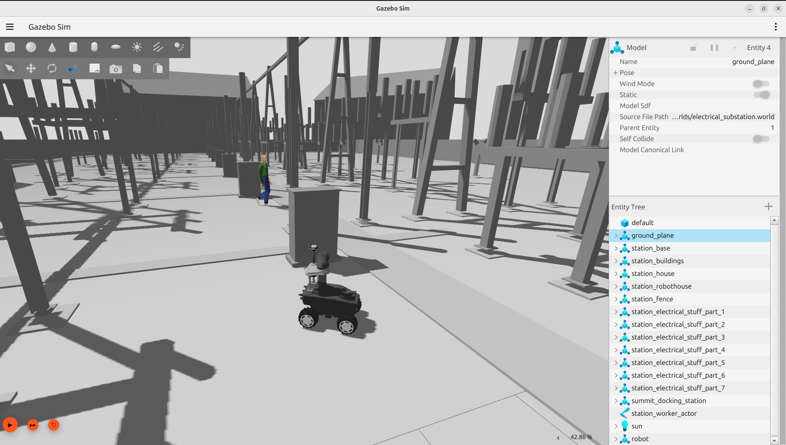
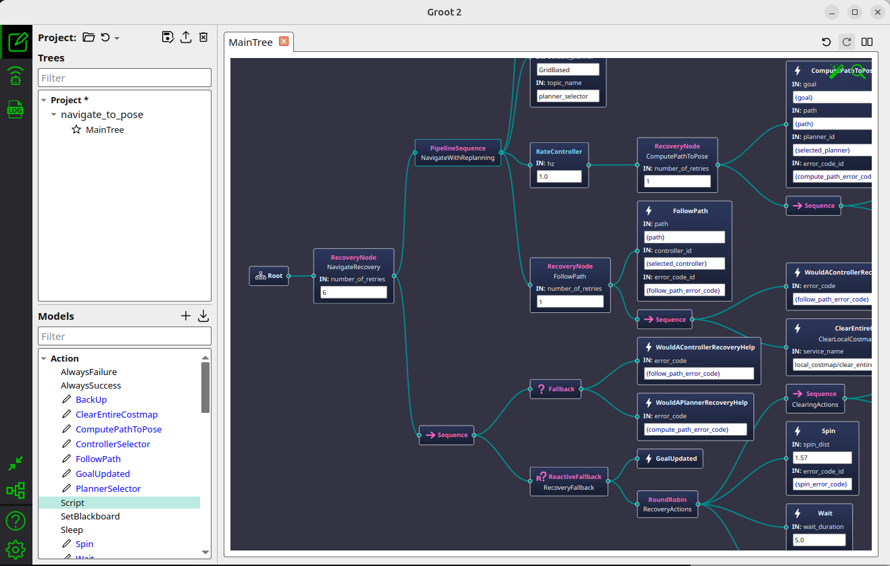
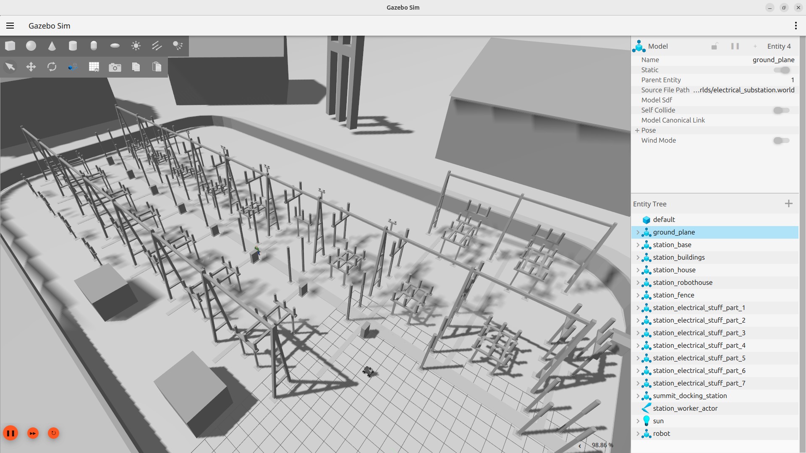
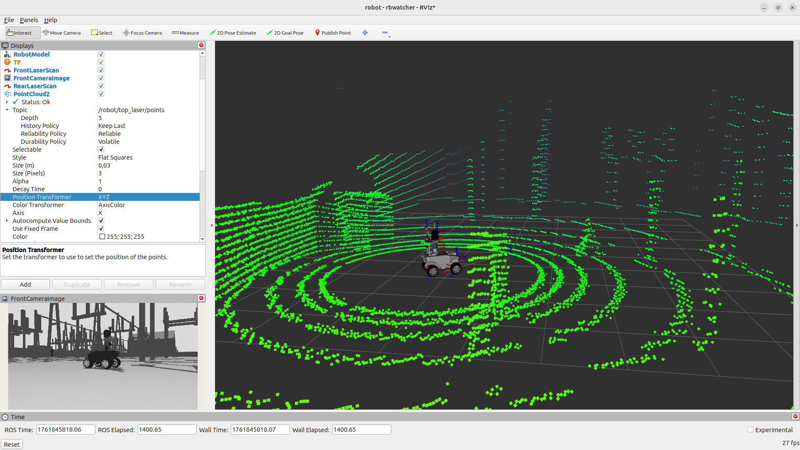
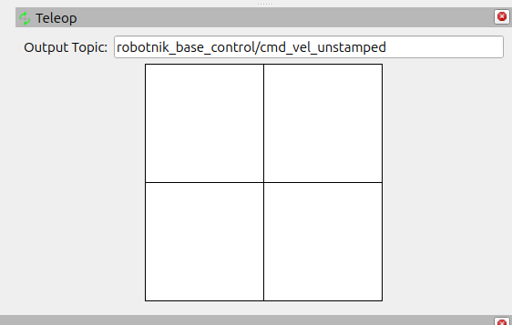
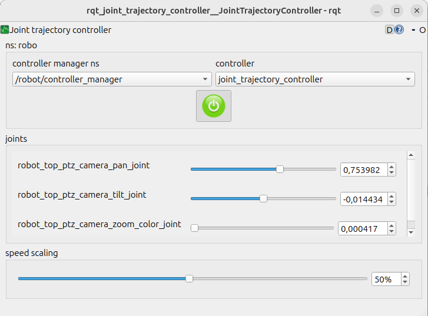
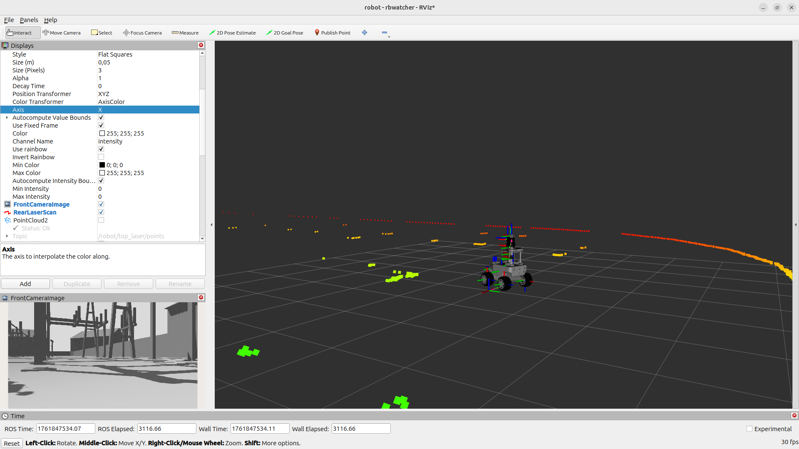
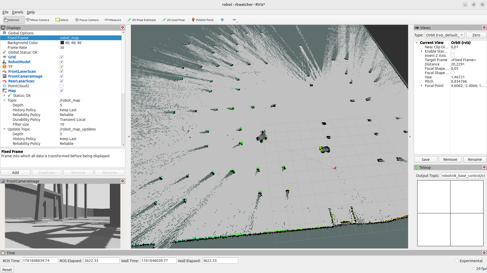
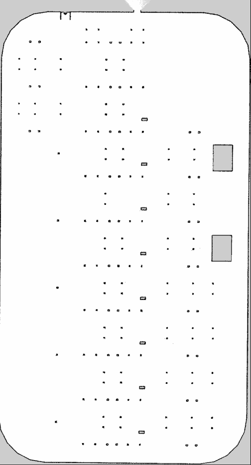
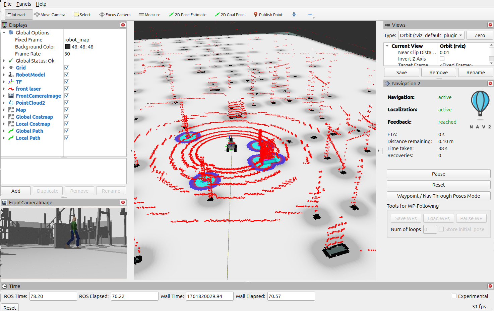

# roscon2025_rbwatcher_workshop

RB-Watcher ROS2 digital twin in an electrical substation for autonomous inspection using the Nav2 stack.



## Installation


This section assumes that you have ROS 2 Jazzy and Gazebo Harmonic installed on Ubuntu 24.04.

Create workspace
```
mkdir -p ~/workspaces/roscon_ws/src
```

Clone repository
```
cd ~/workspaces/roscon_ws/src
git clone --recurse-submodules -b jazzy-devel https://github.com/RobotnikAutomation/robot_packages.git
```

Install dependencies
```
cd ~/workspaces/roscon_ws
sudo apt-get update
rosdep update
rosdep install --from-paths src --ignore-src -r -y
sudo apt install -y $(find -name '*ros-jazzy-robotnik*.deb')
```


Build the packages:
```
cd ~/workspaces/roscon_ws
colcon build --symlink-install
source install/setup.bash
```

### Groot

In order to visualize and edit Behavior Trees, we will use Groot2.

Download [Groot2](https://www.behaviortree.dev/groot/) AppImage(Linux) in `~/Downloads` folder

```
cd ~/Downloads
chmod +x Groot2-*.AppImage
```

Run Groot2:

```
cd ~/Downloads
./Groot2-*.AppImage 
```



## Introduction

This workshop is focused on the `RB-Watcher` robot model, a mobile robot designed for surveillance and  inspection tasks in multiple environments, including electrical substations. The simulation environment is based on a detailed Gazebo world that replicates the conditions of an electrical substation, allowing users to test and validate autonomous navigation and inspection algorithms using the Nav2 stack.


## TASK 1: Launch the simulation

The goal is to launch the Gazebo world and the RB-Watcher robot model and verify that everything is working properly.


Launch the electrical substation world:

```
ros2 launch robotnik_gazebo_ignition spawn_world.launch.py world_path:=$(ros2 pkg prefix electrical_substation_world)/share/electrical_substation_world/worlds/electrical_substation.world  gui:=true
```

TIPs:
 - You can change `gui:=true` to `gui:=false` to launch Gazebo without the graphical interface.
 - You can also modify the `world_path` parameter to load a different world.
 - You can set the environement variable `LOW_PERFORMANCE_SIMULATION` to true to reduce the simulation quality for low performance computers:
 
```
export LOW_PERFORMANCE_SIMULATION=true
```

Launch the RB-Watcher robot model in Gazebo:
```
ros2 launch robotnik_gazebo_ignition spawn_robot.launch.py robot:=rbwatcher x:=-19 y:=6 run_rviz:=true
```



TIP: 
 - You can set `run_rviz:=false` to avoid launching RViz automatically.
 - You can change the `x` and `y` parameters to modify the robot's initial position in the world.

Extra: We can spawn multiple robots by changing the `x` and `y` parameters, and the robot_id:

```
ros2 launch robotnik_gazebo_ignition spawn_robot.launch.py robot:=rbwatcher x:=-19 y:=4 robot_id:=robot_2 run_rviz:=false
```

## TASK 2: Controllers and Sensors

The goal is to understand how to control the robot and visualize the sensor data.

### Robot Controllers

Based on ROS2 control Robotnik's skid steering controller.

```
ros2 topic echo /robot/robotnik_base_control/odom
```

### Pan-Tilt-Zoom Camera

The control is based on ROS2 control joint trajectory controller.

The video stream can be visualized using `rqt_image_view` or rviz:

```
ros2 run rqt_image_view rqt_image_view /robot/top_ptz_rgbd_camera/color/image_raw
```

### RGB Camera

The video stream can be visualized using `rqt_image_view` or rviz:

```
ros2 run rqt_image_view rqt_image_view /robot/front_rgbd_camera/color/image_raw
```

### 3D LIDAR

The point cloud can be visualized using `rviz`



### IMU

```
ros2 topic echo /robot/imu/data
```

## TASK 3: Basic control

### Teleoperation of the robot base

We can teleoperate the robot using the `teleop_twist_keyboard` package:

```
ros2 run teleop_twist_keyboard teleop_twist_keyboard --ros-args -r cmd_vel:=/robot/robotnik_base_control/cmd_vel -p stamped:=true
```

We can teleoperate the robot using the RVIZ teleop panel:



### Teleoperation of the PTZ camera

We can control the PTZ camera using the `joint_trajectory_controller`:

```
ros2 run rqt_joint_trajectory_controller rqt_joint_trajectory_controller --ros-args --remap __ns:=/robot
```



## TASK 4: Mapping

We can create a 2D map of the environment using the `slam_toolbox` package:

First, we need a 2D laser scan from the 3D LIDAR. We can use the `pointcloud_to_laserscan` package to convert the point cloud to a 2D laser scan:   


```
ros2 launch robotnik_simulation_bringup laser_filters.launch.py 
```




Then, we can run the `slam_toolbox` node to create the map:

```
ros2 launch robotnik_simulation_localization mapping_2d.launch.py
```



Move around the robot using teleoperation to create the map.

Once the map is created, we can save it using the `map_saver` node:

```
ros2 run nav2_map_server map_saver_cli -f ~/map
```



## TASK 5: Localization & Navigation

We can localize the robot using the `amcl` package:

```
ros2 launch robotnik_simulation_localization localization.launch.py
```

## Bringup all

Launch complete simulation:

```
ros2 launch robotnik_simulation_bringup bringup_complete.launch.py
```

Launch rviz:

```
 ros2 launch robotnik_simulation_bringup rviz.launch.py
```



